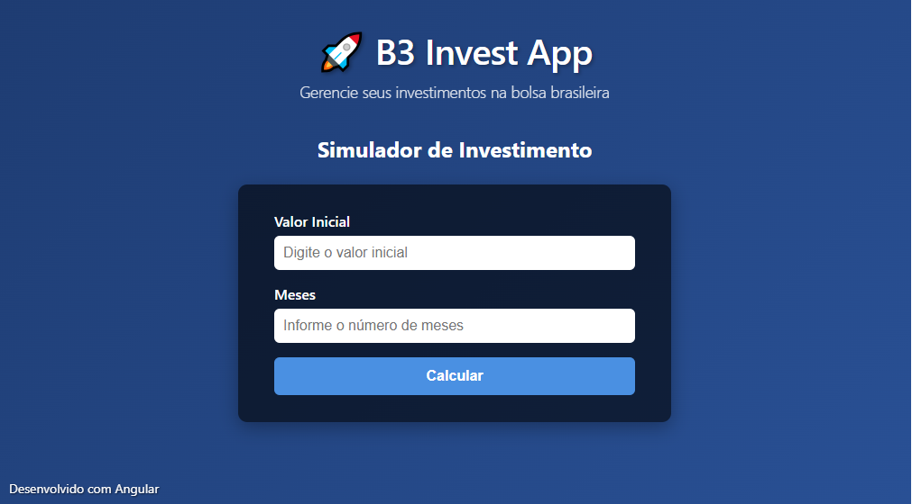

# B3.Invest Project

Este projeto consiste em uma API backend em .NET 8 e uma aplicação frontend Angular para cálculos de investimentos.



## 📋 Pré-requisitos

### Backend (.NET)
- [.NET 8 SDK](https://dotnet.microsoft.com/download/dotnet/8.0)
- [Docker](https://www.docker.com/products/docker-desktop/) (opcional, para deployment containerizado)

### Frontend (Angular)
- [Node.js](https://nodejs.org/) (versão LTS recomendada)
- npm (vem com o Node.js)
- Angular CLI
    ```bash
    npm install -g @angular/cli
    ```

## 🚀 Instalação

### Configuração do Backend
1. Navegue até o diretório do projeto da API
    ```bash
    cd src/1-API/B3.Invest
    ```
2. Restaure as dependências
    ```bash
    dotnet restore
    ```

### Configuração do Frontend
1. Navegue até o diretório do projeto Angular
    ```bash
    cd src/5-www/B3.Invest.Web
    ```
2. Instale as dependências
    ```bash
    npm install
    ```

## ▶️ Executando as Aplicações

### Opção 1: Executar Separadamente

#### API (.NET)
1. Navegue até o diretório do projeto da API
    ```bash
    cd src/1-API/B3.Invest
    dotnet run
    ```
2. A API estará disponível em:  
   [http://localhost:5212/swagger/index.html](http://localhost:5212/swagger/index.html)

#### Frontend (Angular)
1. Navegue até o diretório do projeto Angular
    ```bash
    cd src/5-www/B3.Invest.Web
    ng serve
    ```
2. O site estará disponível em:  
   [http://localhost:4200/](http://localhost:4200/)

### Opção 2: Executar Ambos Simultaneamente (Visual Studio)

Como este é um projeto único com múltiplos projetos, você pode executar ambos simultaneamente:

1. **No Visual Studio**, clique com o botão direito na **Solution** no Solution Explorer
2. Selecione **Properties** (ou **Property Pages**)
3. Vá para **Configure Startup Projects**
4. Selecione **Multiple startup projects**
5. Na coluna **Action**, configure ambos os projetos como **Start**:
   - `B3.Invest` → **Start**
   - `B3.Invest.Web` → **Start**
6. Clique em **OK** e execute o projeto (F5)

### Opção 3: Executar com Docker

#### API (.NET)
1. Construa e execute o container da API:
    ```bash
    cd src/1-API/B3.Invest
    docker build -t b3invest-api .
    docker run -d -p 8080:8080 -p 8081:8081 --name b3invest-api b3invest-api
    ```
2. A API estará disponível em:  
   `http://localhost:8080/swagger/index.html`

## ⚙️ Configurações Importantes

### Build para Produção - Frontend Angular

Para gerar os arquivos otimizados para produção do Angular:

```bash
cd B3.Investment\B3.Invest.Web
ng build --configuration production
```

Os arquivos serão gerados na pasta `dist/` e estarão prontos para deploy em qualquer servidor web.

#### Opções de Deploy:

**1. Servidor Web Tradicional (IIS, Apache, Nginx):**
- Copie todo o conteúdo da pasta `dist/b3-invest-web/` para o diretório do servidor
- Configure o servidor para servir arquivos estáticos
- Configure redirecionamento para `index.html` para suporte ao roteamento Angular

### Configuração de URL para Docker
Se você executar a API via Docker, será necessário alterar a URL no projeto Angular:

**Arquivo:** `B3.Investment/B3.Invest.Web/src/app/investment.service.ts`

```typescript
// Para execução local
private apiUrl = 'http://localhost:5212/api';

// Para execução via Docker
private apiUrl = 'http://localhost:8080/api';
```

## 🌐 URLs de Acesso

| Aplicação | Execução Local | Execução Docker |
|-----------|----------------|-----------------|
| API | http://localhost:5212/swagger/index.html | http://localhost:8080/swagger/index.html |
| Frontend AngularJS | http://localhost:4200/ | - |

## 📝 Notas Adicionais

- Certifique-se de que as portas 5212 (API) e 4200 (Angular) estejam disponíveis
- Para produção, configure variáveis de ambiente para as URLs da API
- Ajuste as configurações de CORS na API conforme necessário
- O projeto utiliza Swagger para documentação da API
- Para desenvolvimento, recomenda-se executar ambos os projetos simultaneamente usando a configuração do Visual Studio

## 🛠️ Troubleshooting

### Problemas Comuns:
- **Porta em uso**: Altere a porta no `launchSettings.json` (API) ou use `ng serve --port 4201` (Angular)
- **CORS**: Verifique as configurações de CORS na API
- **Dependências**: Execute `dotnet restore` e `npm install` novamente se houver problemas

